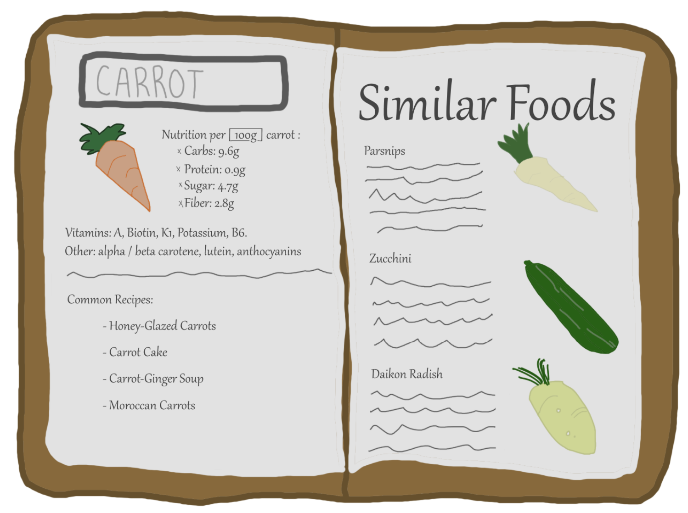

# NourishNet

## Introduction

Welcome to NourishNet, a web application that revolutionizes and simplifies our food eating habits & experiences. This is a collaborative Senoir Design & Research Project. 

### Problem Statments

The goal is to create an application to serve as an aid to dietary management and
nutritional education. It will provide users with the information and resources to
improve their health through changes to their eating habits, primarily by means of
a multifaceted and feature-rich index of culinary knowledge. 

In today's fast-paced world, individuals and families often struggle with meal planning, which
leads to repetitive meals, unnecessary food waste, and frequent, costly trips to the grocery
store.
Traditional recipe platforms offer an overwhelming number of choices but do not adapt to the
unique constraints of each user, such as available ingredients or dietary restrictions.
Additionally, these platforms rarely integrate other features like inventory management or
health metrics, requiring users to switch between multiple apps for a complete meal planning
solution.
The lack of a single, user-friendly platform that combines real-time ingredient tracking,
personalized meal suggestions, and nutritional guidance hampers the ability to efficiently and
healthily utilize household food supplies.


## Features

- Recipe Calculator: Sort and see which foods are abundnant in the selected nutrient & see the nutrients of a selected food items and meals.
- Cooking Companion: A comprehensive recipe book that will guide each user to finding recipes based on thier unique dietary lifestyle and health restrictions.
- Skill-Level Sorting: A system that will encourage users that aren't traditionally skilled in cooking to gaining skills in a fun and effective manner. 
- Dynamic Suggestions: Recommendations for the user based on thier data, feedback and eating habits. 
-Social Sharing: See top viewed and/or rated recipes and see comments from users. Share recipes or ingrediens lists with friends, family, and community groups. 
-User Badges: A system that will show if a user is a verified professional nutritionist, chef, and or top rated contributer.




## App Features

### Backend:

* The backend is built with node.js , [express.js Framework](https://expressjs.com/) ,and MySQL Database
* Generic Crud Api (Create / Read / Update / Delete)
* Admin (User) Management Api

### Frontend:

* The Frontend is built with HTML, CSS, JS, React.js 
* Generic Crud Component (Module) (Create / Read / Update / Delete)
* Admin (User) Management Module
* Auth Component Login / Logout
* Private Route and Public Route
* Not Found Page
* Beautiful UI Dashboard

## Installation

1. Clone the repository: 
```git clone https://github.com/NourishNet/NourishNetApp.git```
2. Navigate to the project directory: 
```cd NourishNetApp```
3. Install the required dependencies: 
```npm install```

## Usage

1. Start the server: 
```npm start```
2. Access the app in your web browser at 
```http://localhost:3000```

## Contributing

Contributions are welcome! If you would like to contribute to NourishNet, please follow these steps:

1. Fork the repository
2. Create a new branch
3. Make your changes
4. Submit a pull request

## License

This project is licensed under the [MIT License](LICENSE).

Feel free to explore, modify, and distribute NourishNet according to the terms of the license. Your contributions and enhancements are highly appreciated!

## Contact

For any inquiries or feedback, please reach out to 
jack.goldman.956@my.csun.edu or angelcrowe.tech@gmail.com

Join us on NourishNet, where the food and  experience is redefined. 